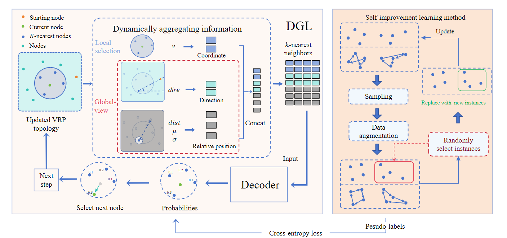

## DGL
This is the GitHub repository for 'DGL: Dynamic Global-Local Information Aggregation for Scalable VRP Generalization with Self-Improvement Learning'.

## DataSet
We use the same dataset as [INViT](https://github.com/Kasumigaoka-Utaha/INViT), Please prepare your dataset under the data directory in the project root directory first.

## How to run
**train**
~~~shell
cd CVRP
python train.py

cd ..
cd TSP
python train.py
~~~

**test**
~~~shell
cd CVRP
python test.py

cd ..
cd TSP
python test.py
~~~

## Acknowledgments
We would like to thank the following repository, which is the baseline of our code:

https://github.com/Kasumigaoka-Utaha/INViT

https://github.com/CIAM-Group/NCO_code/tree/main/single_objective/LEHD
